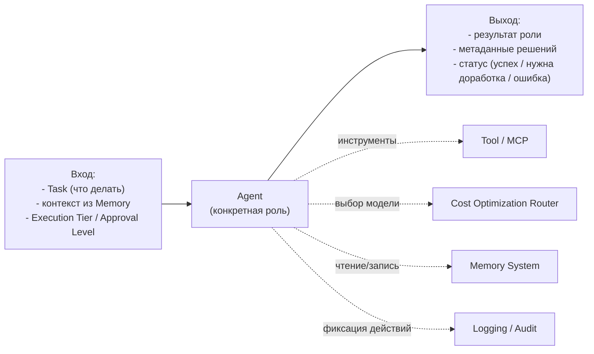

# Agent Framework

Статус: Draft v0.1 — на ревью
Назначение: описать единый "шаблон", по которому устроен любой агент в системе — независимо от того, SEO это, Copywriter или QA. Это самый важный документ в архитектуре: если шаблон удобный и достаточно общий, добавление новой роли (специальности) в будущем — это просто "заполнить шаблон", а не переписывать систему.

Простыми словами: представьте, что вы нанимаете нового сотрудника в агентство. У вас, скорее всего, есть общий формат: должностная инструкция (что делает), что ему нужно от других, чтобы начать работу, что он должен сдать в конце, куда он записывает результаты, какими инструментами пользуется, и что происходит, если он не справился. Agent Framework — это именно такая универсальная "должностная инструкция", одна на все роли. Konkретное содержание (что именно делает SEO-специалист) описывается позже, отдельно для каждой роли — здесь фиксируется только форма.

Использует термины из [[Glossary]]. Реализует [[Functional-Requirements]] (FR-9…FR-15) и опирается на решения [[Architecture-Overview]] (ADR-0001, ADR-0002, ADR-0003).

---

## Purpose

Зафиксировать единый контракт агента, чтобы:
- Workflow Engine мог одинаково запускать любого агента, не зная деталей его специальности;
- новая роль добавлялась регистрацией по контракту, без изменения ядра (NFR-10);
- Cost Optimization, Memory System и Logging/Audit могли работать со всеми агентами единообразно.

## Scope

Документ описывает структуру контракта агента (11 обязательных элементов из директивы) и правила его исполнения. Не описывает: содержание конкретных ролей (SEO, Copywriter и т.д. — это будущие отдельные спецификации ролей, вне Этапа 1 в полном объёме), внутреннее устройство Workflow Engine (отдельный документ), схему хранения памяти (Memory System).

---

## 1. Из чего состоит контракт агента

Директива требует по каждому агенту зафиксировать 11 элементов. Ниже — что каждый из них означает простыми словами и как он реализуется в системе.

| Элемент | Простыми словами | Как реализуется |
|---|---|---|
| **Назначение** | Одно предложение: зачем эта роль вообще существует | Текстовое описание в спецификации роли |
| **Ответственность** | За что этот агент отвечает, а за что — нет (например, Copywriter пишет тексты, но не решает, где их размещать) | Явные границы в спецификации роли, проверяются на пересечение с другими ролями при добавлении |
| **Интерфейс** | Как Workflow Engine "разговаривает" с агентом — по одному и тому же протоколу для всех | Единый формат вызова: вход → агент → выход (см. раздел 2) |
| **Входные данные** | Что агент обязан получить, чтобы начать работу | Структурированный вход + доступ к нужным уровням Memory (Task/Project/Company/Knowledge Base) |
| **Выходные данные** | Что агент обязан вернуть по завершении | Структурированный результат + метаданные (что сделано, какие решения приняты) — идёт в Project Output (см. Functional Requirements, FR-6) |
| **Память** | К каким "воспоминаниям" агент имеет доступ | Правила чтения/записи по уровням Memory System (отдельный документ) — Agent Framework только фиксирует, что у роли есть заявленный набор уровней доступа |
| **Используемые инструменты** | Что агент может "нажимать" во внешнем мире (например, поиск в интернете, обращение к API сайта) | Список Tool, доступных роли, через Tool Integration/MCP |
| **Модели** | Какую LLM использует агент | Не хардкодится в самом агенте — выбирается Cost Optimization Router по Execution Tier и сложности задачи (ADR-0003) |
| **Ограничения** | Чего агент делать не должен (бюджет, время, запрещённые действия) | Лимиты, привязанные к Execution Tier (Fast/Standard) и Approval Level |
| **Критерии завершения** | Как понять, что агент закончил и справился | Явное условие "готово" в спецификации роли + проверка QA Agent (FR-11) |
| **Обработка ошибок** | Что происходит, если агент не смог выполнить задачу | Единый протокол ошибок (раздел 4) — не изобретается заново для каждой роли |
| **Взаимодействие с другими агентами** | Кто передаёт агенту работу и кому он передаёт результат | Определяется Workflow (граф ролей), не самим агентом — агент не обязан "знать" про других агентов напрямую |

Ключевое архитектурное решение: **из 11 элементов только "Назначение", "Ответственность" и "Критерии завершения" уникальны для каждой роли. Всё остальное — общий механизм, одинаковый для всех.** Именно это делает добавление новой роли дешёвым (NFR-10).

## 2. Единый интерфейс агента (концептуально)

Ни один агент не вызывает другого агента напрямую — это обеспечивает Workflow Engine. Это архитектурное правило: агенты не знают друг о друге, они знают только свой контракт. Так новая роль не ломает существующие связи.

## 3. Пример на референсном конвейере

Чтобы контракт не был абстракцией, распишем его на одной реальной роли — PPC Agent, в составе задачи "настроить рекламные кампании в Google Ads/Яндекс.Директ/VK Ads" (референсный пример, используемый последовательно во всех документах раздела 03-architecture — см. Workflow Engine, раздел 1: без SEO/UI Designer, но с PPC/Media Buyer):

- **Назначение:** настроить и запустить рекламные кампании клиента в указанных каналах.
- **Ответственность:** только настройка кампаний, не медиапланирование бюджета (это Media Buyer Agent) и не создание текстов объявлений (это Copywriter Agent, если подключён).
- **Вход:** URL сайта, описание бизнеса, результаты Research Agent.
- **Выход:** структура настроенных кампаний + список ключевых решений (например, "бюджет распределён 60/40 между Google Ads и VK Ads, потому что...").
- **Критерий завершения:** результат проходит проверку QA Agent по чек-листу качества PPC-раздела.

Если бы вместо этого задача была "написать SEO-стратегию для сайта" — PM Agent включил бы SEO Agent вместо PPC/Media Buyer; контракт агента при этом не меняется ни для одной роли, меняется только состав вызываемых ролей (Product Specification, раздел 2.2; Functional Requirements, FR-6).

## 4. Единый протокол ошибок

Каждый агент по завершении обязан вернуть один из статусов:

- **Success** — результат готов, соответствует критериям завершения.
- **Needs Revision** — агент не уверен в качестве, просит проверку QA до продолжения Workflow.
- **Failed** — агент не смог выполнить задачу (например, недоступен внешний сайт для Research).

`Failed` — это не крах системы: он обрабатывается Workflow Engine и Recovery (ADR-0002) как штатная ситуация, а не сбой. Ошибка фиксируется в Logging/Audit (FR-12) и может инициировать повтор, эскалацию (Approval Level) или пометку Task как заблокированной для человека.

## 4a. Мета-роль: Agent Architect

Отдельная служебная роль, не участвующая в исполнении маркетинговых Project, а помогающая создавать спецификации новых ролей по шаблону из раздела 1 (закрывает Open Question 2, см. ниже).

Простыми словами: это "архитектор кадров" внутри цифровой компании. Вы описываете, какая роль нужна (например, "специалист по email-рассылкам"), Agent Architect формирует черновик спецификации — назначение, ответственность, вход/выход, инструменты, критерии готовности — по единому контракту, чтобы ничего важного не забыть и не нарушить границы существующих ролей.

**Ограничение (обязательное, следствие принципа директивы "критичные решения не принимаются автономно"):** Agent Architect только предлагает спецификацию роли. Регистрация новой роли в Workflow (то есть возможность PM Agent реально её вызывать) требует вашего явного утверждения — по аналогии с Approval Level для Project. Agent Architect не создаёт и не активирует роли самостоятельно.

## 5. Расширяемость (реализация NFR-10)

Добавление новой роли — это:
1. Написать спецификацию роли (Назначение, Ответственность, Критерии завершения — по разделу 1).
2. Указать нужные Tool и уровни Memory.
3. Зарегистрировать роль в Workflow — PM Agent получает возможность её вызывать.

Ничего из этого не требует изменений в Workflow Engine, Queue, Events или в других ролях — это и есть архитектурная гарантия "сотни ролей без переписывания ядра" (Business Goals, горизонт 5 лет).

---

## Dependencies

- Зависит от: [[Architecture-Overview]] (ADR-0001, ADR-0002, ADR-0003), [[Functional-Requirements]], [[Glossary]].
- От него зависят: `Workflow Engine`, `Memory System`, `Prompt Architecture`, `Tool Integration`, `Cost Optimization`.

## Open Questions

1. **Критерии QA (перенесено из Functional Requirements, Open Question п.3).** Нужно решить: единый чек-лист качества для всех ролей, или свой чек-лист под каждую роль? Пример: критерий качества для SEO-документа отличается от критерия для рекламного макета. Предлагаю простыми словами: вероятно, нужен и общий минимум (например, "результат не пустой, соответствует формату"), и специфичный чек-лист под роль — но нужно ваше подтверждение, прежде чем закладывать это в Memory System/QA-документ.
2. ~~Кто пишет спецификации будущих ролей.~~ Решено (2026-08-04): вводится мета-роль Agent Architect (раздел 4a) — предлагает спецификации новых ролей по шаблону, активация роли требует вашего утверждения.

## Decision Log

| Дата | Решение | Автор |
|---|---|---|
| 2026-08-04 | Создана первая версия Agent Framework: единый контракт из 11 элементов, из которых только 3 уникальны для каждой роли; единый протокол ошибок; расширяемость через регистрацию, а не изменение ядра | Draft, ожидает утверждения |
| 2026-08-04 | Добавлена мета-роль Agent Architect: предлагает спецификации новых ролей по контракту Agent Framework, активация роли — только с явным утверждением пользователя | Пользователь |
