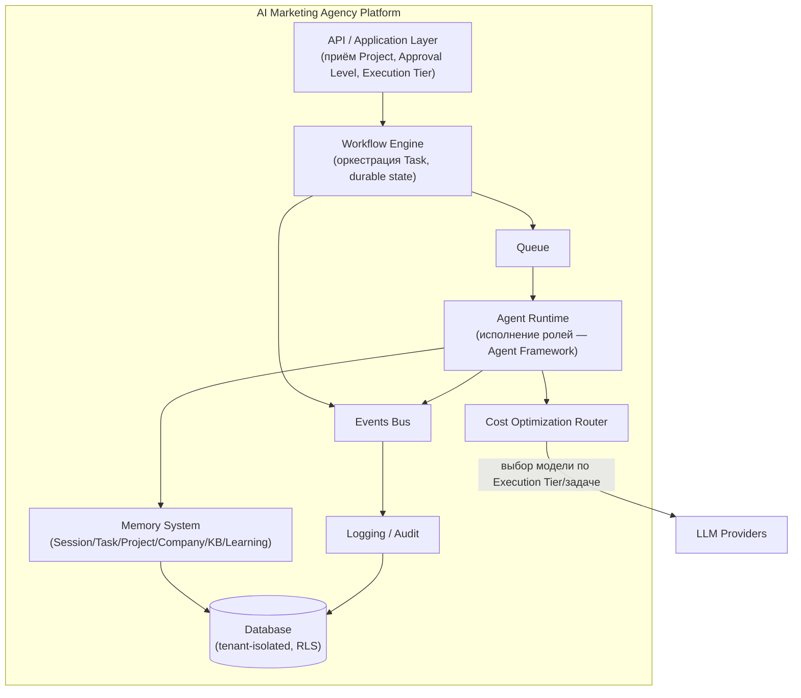

# Architecture Overview

Статус: Draft v0.1 — на ревью
Назначение: зафиксировать общую техническую картину платформы и принять базовые технологические решения (стек, durable execution, LLM-провайдеры), на которые будут опираться все документы раздела `03-architecture`. Это самый дорогой для пересмотра документ в проекте — решения здесь фиксируются через ADR.

Использует термины из [[Glossary]]. Реализует требования [[Non-Functional-Requirements]] и [[Functional-Requirements]].

Разрешены только диаграммы, схемы и псевдокод (директива, Этап 1) — production-код отсутствует.

---

## Purpose

Дать однозначный ответ на три вопроса, без которых нельзя проектировать Agent Framework, Workflow Engine, Database, Queue и Events:
1. на каком инфраструктурном стеке строится платформа;
2. как обеспечивается durable execution (NFR-6, Recovery);
3. как система работает с несколькими LLM-провайдерами (Cost Optimization, FR-15).

## Scope

Документ описывает архитектуру на уровне C4 Context/Container, сравнивает варианты по трём вопросам выше с рекомендацией, и фиксирует итоговое решение после вашего утверждения. Не описывает: внутреннее устройство Agent Framework (отдельный документ), детальную схему БД (Database), конкретные Event-типы (Events).

---

## 1. Системный контекст (C4 Level 1)

```mermaid
flowchart TB
    Owner["Owner (Kalinin Digital Agency)"]
    WL["White-label Specialist / Agency"]
    Platform["AI Marketing Agency Platform"]
    LLM["LLM Providers (Anthropic и др.)"]
    Ext["Внешние источники (сайт клиента, конкуренты, рынок)"]
    Leads["Lead Storage System\n(отдельный проект, сервер в РБ — вне стека платформы)"]

    Owner -->|создаёт Project, получает Output| Platform
    WL -->|создаёт Project под своим брендом| Platform
    Platform -->|вызывает модели| LLM
    Platform -->|анализирует| Ext
    Platform -.->|Frontend Agent публикует лендинг, формы ведут в Leads, не в Platform| Leads
    Leads -.->|только агрегаты (число лидов), без PII| Platform
```

**Граница с Lead Storage System (добавлено 2026-08-04, по итогам независимого технического ревью — закрывает RISK-03a):** когда Project включает создание лендинга (Frontend Agent), формы захвата лидов (имя, телефон) технически ведут не в базу платформы, а напрямую в отдельную систему на сервере в РБ — реализуемую отдельным проектом, вне ADR-0001/стека платформы. Обратно в платформу (для Report Generator/Analytics Agent) может передаваться только агрегированная, обезличенная информация (например, число заявок) — не сами персональные данные. Контракт этой границы (формат передачи агрегатов, если он нужен) — вне Этапа 1, фиксируется при реализации соответствующего отдельного проекта.

Границы системы: платформа не взаимодействует с конечным клиентом Owner/White-label напрямую (Product Specification, раздел 4) — только с самим Owner/специалистом/агентством.

## 2. Контейнерная декомпозиция (C4 Level 2, концептуально)



Ключевое архитектурное свойство (следствие NFR-10): AgentRuntime исполняет роли по единому контракту (Agent Framework) — добавление роли не меняет WFE/Queue/Events/Memory.

---

## 3. Решение 1: инфраструктурный стек

Вы оставили выбор на этот документ. Сравниваю относительно требований: NFR-1 (row-level security), NFR-6 (durable execution), NFR-11 (горизонтальный масштаб), двухконтурная мультитенантность (Business Goals).

| Критерий | Vercel + Supabase | Классический стек (например, AWS/self-hosted: ECS/K8s + RDS + SQS) |
|---|---|---|
| Row-level security (NFR-1) | Нативная поддержка в Postgres/Supabase, минимальная обвязка | Реализуется вручную поверх RDS Postgres — тот же Postgres RLS, но без готовой auth-интеграции |
| Durable workflow (NFR-6) | Есть готовый продукт — Vercel Workflow DevKit (см. раздел 4) | Обычно требует отдельного сервиса (Temporal/Step Functions) — больше инфраструктурных компонентов |
| Скорость старта референсного сценария (Business Goals, веха года 1) | Высокая — меньше инфраструктурного кода до первого рабочего Workflow | Ниже — больше настройки перед первым запуском |
| Горизонтальный масштаб (NFR-11) на горизонте сотен ролей/тенантов | Достаточен для среднесрочного масштаба; при очень большой нагрузке — меньше низкоуровневого контроля | Больше контроля над инфраструктурой при экстремальном масштабе |
| Vendor lock-in | Выше (Vercel/Supabase-специфичные примитивы в Workflow/RLS) | Ниже, но за счёт большей сложности эксплуатации |
| Соответствие текущему окружению | В окружении уже подключены Vercel и Supabase MCP-инструменты — нет предварительной инфраструктурной работы | Требует дополнительной настройки окружения |

**Рекомендация: Vercel + Supabase.** При целях проекта (референсный сценарий Года 1, затем управляемый рост до White Label) издержки vendor lock-in меньше, чем выгода от скорости старта и готового покрытия NFR-1/NFR-6. Если на горизонте 5 лет масштаб потребует выхода за пределы этой платформы — миграция затронет инфраструктурный слой, но не Agent Framework/Workflow-контракт (изоляция достигается через раздел 2: WFE и AgentRuntime не завязаны напрямую на конкретного провайдера БД/деплоя, если Database-документ зафиксирует это явно).

## 4. Решение 2: durable execution

| Критерий | Vercel Workflow DevKit (durable workflow движок) | Собственный механизм на базе Queue + БД (чекпоинты вручную) |
|---|---|---|
| Соответствие NFR-6 (переживание сбоя) | Из коробки — шаги/состояние переживают рестарт по дизайну продукта | Нужно спроектировать и протестировать чекпоинтинг самостоятельно — выше риск ошибок в самой Recovery-логике (директива прямо предостерегает от этого класса рисков) |
| Соответствие NFR-4 (расширяемый Execution Tier) | Конфигурация шагов/ретраев декларативна | Реализуется вручную, больше кода на каждый новый Tier |
| Соответствие NFR-5 (параллелизм для Fast-уровня) | Поддерживает параллельные шаги как часть модели workflow | Требует ручной оркестрации параллельности в Queue-слое |
| Связанность со стеком | Требует выбора Vercel-стека (Решение 1) | Технологически нейтрально |
| Риск для команды из одного разработчика (агентство, не крупная инженерная команда) | Ниже — меньше кастомного кода для поддержки | Выше — Recovery/Workflow код полностью на вашей ответственности |

**Рекомендация: Vercel Workflow DevKit**, при условии принятия Решения 1. Обоснование: NFR-6 (Recovery) и NFR-13/принцип директивы «Recovery должен работать автоматически» — это ровно тот класс функциональности, для которого custom-реализация первой итерации создаёт наибольший архитектурный риск (соответствует риску #5, зафиксированному в самом начале проектирования документации). Использование готового durable-движка не противоречит принципу «архитектура прежде кода» — это выбор платформы для реализации архитектуры, а не отказ от проектирования.

## 5. Решение 3: LLM-провайдеры

| Критерий | Только Anthropic (Claude) | Мульти-провайдер с первой итерации |
|---|---|---|
| Простота Prompt Architecture/Agent Framework на первой итерации | Выше — один формат вызова, одна модель поведения | Ниже — нужен слой абстракции над провайдером уже в Agent Framework |
| Cost Optimization (FR-15, NFR-13) | Достижимо и внутри одного провайдера — линейка моделей (например, младшая/средняя/старшая модель) уже даёт выбор по цене/качеству/скорости под Execution Tier | Шире диапазон цен, но выгода не критична, пока не подтверждена экономика White Label (Business Goals, Open Question) |
| Риск vendor lock-in на провайдера моделей | Выше | Ниже |
| Соответствие принципу директивы «использование только одной модели для всех задач запрещено» | Соблюдается через выбор разных моделей одного провайдера по Execution Tier/сложности задачи — принцип не требует обязательно разных провайдеров | Тоже соблюдается, с большей гибкостью, но большей сложностью |

**Рекомендация: начать с одного провайдера (Anthropic), но проектировать Cost Optimization Router и Agent Framework с абстракцией над «моделью» (не хардкодить провайдер-специфичные вызовы в контракт агента).** Это даёт простоту первой итерации без блокировки будущего мульти-провайдерного расширения — расширение останется добавлением реализации за существующим интерфейсом, а не пересмотром Agent Framework. Признак согласия с принципом Vision («расширяемость — обязательное свойство»).

---

## 6. Сводка решений (переносится в ADR после утверждения)

| № | Решение | Выбор |
|---|---|---|
| 1 | Инфраструктурный стек | Vercel + Supabase |
| 2 | Durable execution | Vercel Workflow DevKit |
| 3 | LLM-провайдеры | Anthropic на первой итерации, абстракция над провайдером в контракте агента |

Каждое решение должно быть оформлено как отдельный ADR (см. `06-governance/adr-index.md`) после вашего утверждения этого документа — согласно директиве («важное решение → RFC → после утверждения → ADR»).

---

## Dependencies

- Зависит от: [[Non-Functional-Requirements]], [[Functional-Requirements]], [[Glossary]].
- От него зависят: `Repository Structure`, `Agent Framework`, `Workflow Engine`, `Memory System`, `Database`, `Queue`, `Events`, `Cost Optimization`, `Security`, `API / Application Layer`.

## Open Questions

1. ~~Подтверждение выбора стека.~~ Решено, см. [ADR-0001](../../adr/0001-infrastructure-stack.md).
2. ~~Подтверждение durable-движка.~~ Решено, см. [ADR-0002](../../adr/0002-durable-execution-engine.md).
3. ~~Формат Project Output.~~ Решено (2026-08-04, см. Functional Requirements Decision Log): гибкий набор, определяемый составом реально задействованных Agent под задачу.

## Связанные ADR

- [ADR-0001](../../adr/0001-infrastructure-stack.md) — Инфраструктурный стек: Vercel + Supabase.
- [ADR-0002](../../adr/0002-durable-execution-engine.md) — Durable execution: Vercel Workflow DevKit.
- [ADR-0003](../../adr/0003-llm-provider-strategy.md) — LLM-провайдеры: Anthropic + абстракция над провайдером.

## Decision Log

| Дата | Решение | Автор |
|---|---|---|
| 2026-08-04 | Создана первая версия Architecture Overview с рекомендациями по стеку, durable execution и LLM-провайдерам | Draft, ожидает утверждения |
| 2026-08-04 | Все три рекомендации утверждены без изменений. Оформлены ADR-0001, ADR-0002, ADR-0003 | Пользователь |
| 2026-08-04 | По итогам независимого технического ревью: добавлен API/Application Layer в зависимые документы; добавлена и задокументирована граница с Lead Storage System (отдельный проект, РБ) на C4-диаграмме — закрывает RISK-03a | Пользователь (по результатам ревью) |
