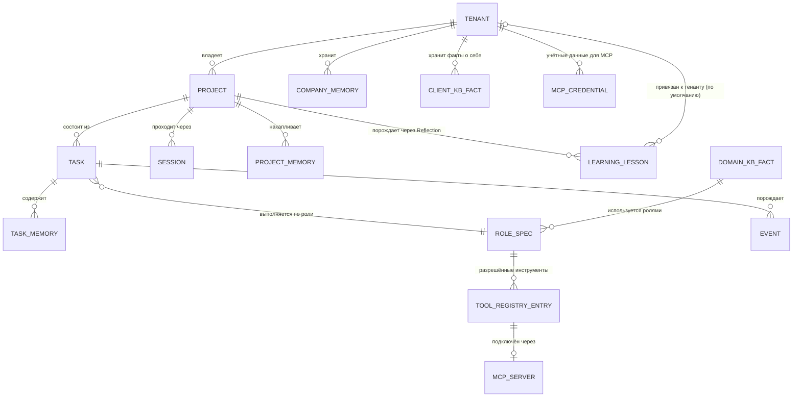

# Database

Статус: Draft v0.1 — на ревью
Назначение: свести воедино всё, что мы уже решили о хранении данных (уровни памяти, Knowledge Base, Learning Memory, события, реестр ролей и инструментов), в единую концептуальную схему — что где хранится и как связано между собой. Это завершающий документ Этапа D (Intelligence Layer).

Простыми словами: если предыдущие документы описывали "какие виды информации существуют и по каким правилам ими пользоваться", то Database — это "как эта информация физически разложена по полочкам одного шкафа", чтобы полки не путались между собой и между разными клиентами.

Использует термины из [[Glossary]]. Сводит требования [[Memory-System]], [[Knowledge-Base]], [[Learning-System]], [[Events]], [[Tool-Integration]]. Опирается на [[Architecture-Overview]] (ADR-0001 — Supabase/Postgres) и [[Non-Functional-Requirements]] (NFR-1, NFR-2 — row-level security).

Разрешена только концептуальная схема (ER-диаграмма), не готовый SQL — production-код запрещён на Этапе 1.

---

## Purpose

Дать единую картину сущностей и связей между ними, чтобы реализация на Этапе 2 не изобретала структуру заново, а переносила уже принятые архитектурные решения в конкретные таблицы.

## Scope

Документ описывает: основные сущности (Tenant, Project, Task, память всех уровней, KB, Learning Memory, события, реестры) и связи между ними; правило tenant_id как обязательного поля. Не описывает: точные типы полей, индексы, миграции — это инженерная реализация Этапа 2.

---

## 1. Обязательное правило: tenant_id

Каждая таблица, содержащая данные, относящиеся к конкретному клиенту (то есть всё, кроме общего домена Knowledge Base и реестров ролей/инструментов), обязана иметь поле `tenant_id` и защищаться row-level security (ADR-0001, NFR-1). Это не деталь реализации, а архитектурное требование, зафиксированное здесь, чтобы ни одна будущая таблица не была создана без него.

## 2. Концептуальная схема сущностей

## 3. Пояснение ключевых сущностей (простыми словами)

| Сущность | Что это | Соответствует документу |
|---|---|---|
| **TENANT** | Владелец (Owner) или White-label клиент | Business Goals, раздел 1-2 |
| **PROJECT / TASK / SESSION** | Единицы работы (Glossary) | Product Specification, Workflow Engine |
| **PROJECT_MEMORY / TASK_MEMORY / COMPANY_MEMORY** | Уровни памяти | Memory System, раздел 1 |
| **DOMAIN_KB_FACT / CLIENT_KB_FACT** | Общие и клиент-специфичные подтверждённые факты | Knowledge Base, раздел 1 |
| **LEARNING_LESSON** | "Урок" из прошлого опыта, привязан к тенанту по умолчанию, может стать общим по решению пользователя | Learning System, раздел 1 и 4 |
| **EVENT** | Факт о происходящем ("Task Started" и т.д.) | Events, раздел 1 |
| **ROLE_SPEC** | Зарегистрированная спецификация роли (SEO, Copywriter и т.д.) | Agent Framework, раздел 1 и 5 |
| **TOOL_REGISTRY_ENTRY / MCP_SERVER** | Утверждённые инструменты и их подключение | Tool Integration, MCP Integration |
| **MCP_CREDENTIAL** | Учётные данные конкретного тенанта для конкретного MCP-сервера (например, ключ доступа к Google Ads клиента) | MCP Integration, раздел 3 |

## 4. Где данные *не* привязаны к тенанту

Единственные сущности без обязательного `tenant_id`: **DOMAIN_KB_FACT** (общий домен знаний), **ROLE_SPEC** (спецификация роли — сама структура роли одна для всех тенантов, хотя *данные*, с которыми она работает, тенант-специфичны), **TOOL_REGISTRY_ENTRY/MCP_SERVER** (сам факт "такой тип инструмента существует и одобрен" общий; конкретные учётные данные — уже в MCP_CREDENTIAL, с tenant_id).

## 5. Пример на referensном сценарии

Project "настроить рекламные кампании" для конкретного клиента: создаётся запись PROJECT с `tenant_id` этого клиента → PM Agent создаёт несколько TASK (по одной на Research/PPC/Media Buyer/Analytics/QA/Report) → каждый TASK по ходу работы пишет в TASK_MEMORY и порождает EVENT → PPC Agent при работе обращается к MCP_SERVER "Google Ads" с MCP_CREDENTIAL именно этого тенанта → по завершении Project Reflection создаёт LEARNING_LESSON, привязанный к этому же tenant_id.

---

## Dependencies

- Зависит от: [[Memory-System]], [[Knowledge-Base]], [[Learning-System]], [[Events]], [[Tool-Integration]], [[Non-Functional-Requirements]], [[Architecture-Overview]].
- От него зависят: `Security` (детализация RLS-политик), `Deployment`, `Scaling`.

## Open Questions

1. **Долгосрочное хранение / архивация Project Memory.** Memory System (раздел 1) оставила это как вопрос политики хранения — здесь только зафиксирована структура, само правило "сколько хранить и когда архивировать" предлагаю закрыть в Security (там же, где политики доступа и хранения).
2. **Формат Project Output как данных.** Открытый вопрос из Functional Requirements закрыт содержательно ("гибкий набор по составу задействованных ролей"), но как это физически хранится в БД (одна таблица с файлами/ссылками, или структура на каждый тип материала) — деталь реализации Этапа 2, не архитектурное решение.

## Decision Log

| Дата | Решение | Автор |
|---|---|---|
| 2026-08-04 | Создана первая версия Database: концептуальная ER-схема, сводящая все уровни памяти, KB, Learning Memory, события и реестры ролей/инструментов; обязательное правило tenant_id везде, кроме общего домена и реестров | Draft, ожидает утверждения |
| 2026-08-05 | Реализовано в коде: `supabase/migrations/0001_init.sql` — ER-схема как реальные таблицы + RLS. Изоляция (NFR-1/NFR-2/NFR-14) проверена не в TypeScript-заглушке, а на настоящем Postgres в одноразовом Docker-контейнере (`supabase/tests/rls_isolation_test.sh`, 8/8 проверок пройдено): клиент без указанного тенанта не видит ничего (fail-closed), клиент A не видит данные клиента B, общий домен виден без привязки к тенанту | Пользователь |
