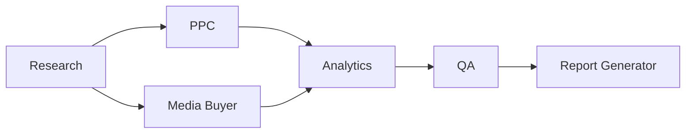
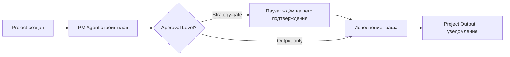

# Workflow Engine

Статус: Draft v0.1 — на ревью
Назначение: описать, как система решает, в каком порядке запускать агентов, что делать, если один агент ждёт результат другого, что происходит при сбое, и как работает пауза на ваше подтверждение (Strategy-gate).

Простыми словами: если Agent Framework — это "должностная инструкция" для одного сотрудника, то Workflow Engine — это диспетчер/координатор в цифровом агентстве. Он не выполняет работу сам, а следит: кто сейчас должен работать, кто закончил, кому передать результат дальше, и что делать, если что-то пошло не так или процесс внезапно остановился (например, "упал сервер").

Использует термины из [[Glossary]]. Реализует [[Functional-Requirements]] (FR-2, FR-2a, FR-9, FR-13) и [[Non-Functional-Requirements]] (NFR-4, NFR-5, NFR-6). Опирается на [[Architecture-Overview]] (ADR-0002 — Vercel Workflow DevKit) и контракт агента из [[Agent-Framework]].

---

## Purpose

Зафиксировать, как строится и исполняется Workflow (граф Task между агентами), чтобы Recovery, Queue и Events могли проектироваться на основе одной и той же модели, а не изобретаться заново под каждый Execution Tier или Approval Level.

## Scope

Документ описывает: как Project превращается в граф Task, как выполняется параллельно/последовательно, как работает пауза на подтверждение (Strategy-gate), что происходит при ошибке или сбое (концептуально — на уровне поведения, не кода). Не описывает: конкретный формат хранения состояния в БД (Database), конкретные типы событий (Events), как выглядит очередь физически (Queue).

---

## 1. От Project к графу Task (пример на понятном сценарии)

Когда вы создаёте Project, происходит следующее (пример — задача "настроить рекламные кампании", как вы приводили раньше):

1. **PM Agent** получает Project и решает, какие роли нужны — например: Research → PPC → Media Buyer → Analytics → QA → Report Generator (SEO/UI Designer не подключены, так как задача не про сайт).
2. PM Agent строит из этого **граф Task** — кто после кого, а что можно делать одновременно. Например, PPC и Media Buyer могут готовить свои части параллельно, если оба опираются только на результат Research, но не друг на друга.
3. Workflow Engine берёт этот граф и начинает "диспетчеризацию" — по очереди (или параллельно) передаёт Task нужным агентам через Queue.

Это конкретный пример графа для одной задачи — для другой задачи PM Agent построит другой граф из тех же "кубиков" (ролей).

## 2. Как влияет Execution Tier (Fast / Standard)

Разница между уровнями — не другой граф, а то, **насколько тщательно** он проходится:

- **Fast:** независимые ветки графа (например, PPC и Media Buyer выше) запускаются строго параллельно, минимум внутренних самопроверок у каждого агента до QA.
- **Standard:** те же ветки могут дополнительно проходить внутренние итерации доработки внутри роли до передачи дальше, Research может выполняться глубже.

Технически это означает, что Execution Tier — это **настройка** (сколько повторов, насколько строгий QA, разрешён ли откат на доработку), а не отдельная реализация Workflow Engine (реализует NFR-4).

## 3. Approval Level и точка паузы (Strategy-gate)

По умолчанию (наше решение ранее) включён Strategy-gate — значит, граф строится в два шага:

1. PM Agent строит план (список ролей и порядок) → Workflow Engine **останавливается** и показывает план вам.
2. Вы подтверждаете (или просите изменить) → только после этого Workflow Engine начинает реально запускать агентов.

Если выбран Output-only — шаг 1 пропускается, Workflow Engine запускает граф сразу после построения плана.

## 4. Что происходит при ошибке одного агента

Опирается на протокол ошибок из Agent Framework (раздел 4 того документа):

- **Success** → Workflow Engine передаёт результат следующему по графу.
- **Needs Revision** → Workflow Engine направляет результат на QA/доработку прежде, чем двигаться дальше — граф не идёт вперёд с непроверенным результатом.
- **Failed** → Workflow Engine решает по правилам: повторить попытку (retry), эскалировать вам как незапланированную точку подтверждения, или пометить Task как заблокированную. Само правило (когда что применять) — уточняется в Recovery.

## 5. Что происходит при сбое всей системы ("упал сервер")

Это NFR-6 и ADR-0002. Поскольку граф исполняется через Vercel Workflow DevKit, состояние графа (кто закончил, что в процессе, что ещё не начато) сохраняется автоматически, а не только "в памяти" процесса. Простыми словами: если систему пришлось перезапустить посреди работы, она не начинает Project заново и не теряет уже сделанную часть — она продолжает с того места, где остановилась. Детали самого механизма восстановления (как именно определяется "где остановились") — отдельный документ Recovery, здесь фиксируется только требование, что Workflow Engine это поддерживает по своей природе.

## 6. Расширяемость под сотни ролей

Workflow Engine не "знает" заранее про конкретные роли — он работает с графом, который ему построил PM Agent из зарегистрированных ролей (Agent Framework, раздел 5). Добавление новой роли или нового возможного графа не требует изменений в самом Workflow Engine — это прямая реализация NFR-10 на уровне оркестрации.

---

## Dependencies

- Зависит от: [[Agent-Framework]], [[Functional-Requirements]], [[Non-Functional-Requirements]], [[Architecture-Overview]] (ADR-0002).
- От него зависят: `Queue`, `Events`, `Recovery`, `Memory System` (Task/Project Memory обновляются по ходу графа), `API / Application Layer` (Strategy-gate контракт).

## Open Questions

1. **Что именно показывается вам на паузе Strategy-gate.** Весь граф целиком (список ролей и порядок), или только краткое текстовое резюме плана? Влияет на UX (Этап 2) и на то, что PM Agent обязан формировать как "план" на выходе. Предлагаю решить ближе к Product-слою реализации, не блокирует следующий документ.
2. **Правило выбора между retry / эскалацией / блокировкой при Failed (раздел 4).** Зависит от Execution Tier? От того, сколько раз уже был retry? Предлагаю закрыть в документе Recovery, так как это его прямая зона ответственности.

## Decision Log

| Дата | Решение | Автор |
|---|---|---|
| 2026-08-04 | Создана первая версия Workflow Engine: граф Task строится PM Agent, Execution Tier — настройка исполнения графа (не отдельная реализация), Strategy-gate — пауза перед исполнением, состояние графа переживает сбой благодаря ADR-0002 | Draft, ожидает утверждения |
